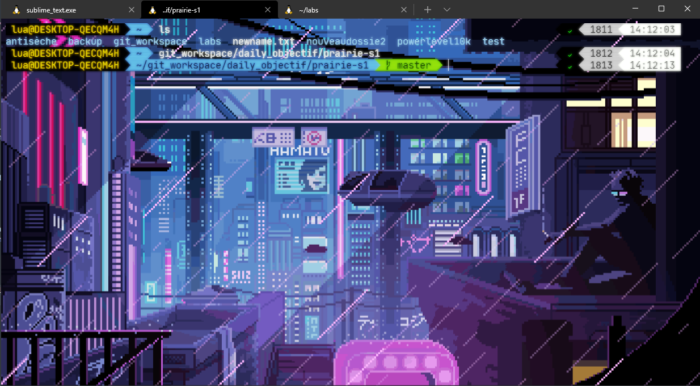
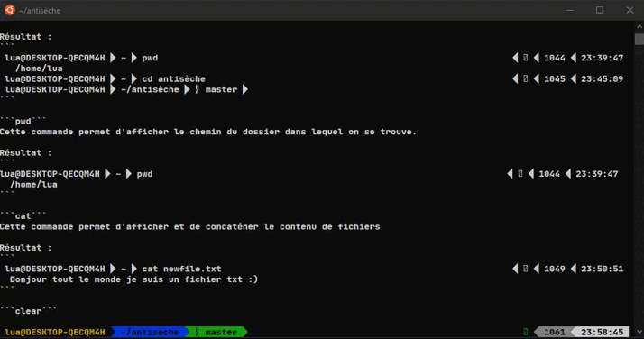
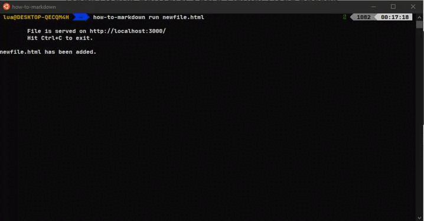
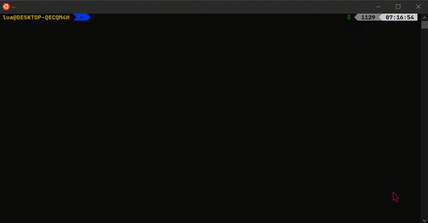
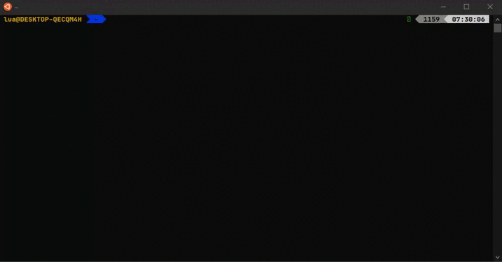
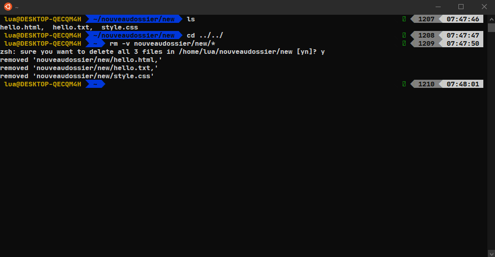
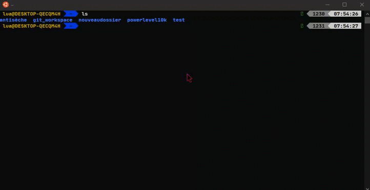
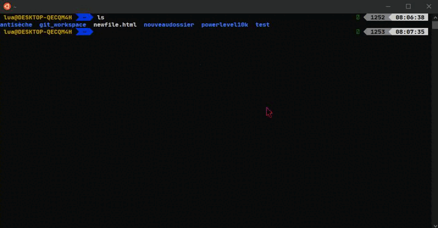
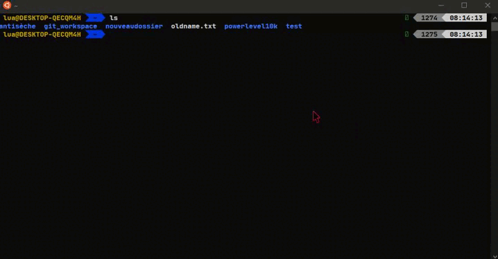

# L'antisèche

Ce guide à pour but de faire une cure de rappel pour les poissons rouge sur les commandes [Linux](https://www.linux.org), [Git](https://git-scm.com) et sur d'autres thème vu pendant mon parcours d'apprentissage ou professionnel.

- ## Sommaire

  - [Qu'est-ce que c'est Linux ?](#linux)
  - [Pourquoi utiliser le Terminal ?](#pourquoi-utiliser-le-terminal-)
  - [Les différentes commandes apprises sur un terminal](#les-différentes-commandes-apprises-sur-un-terminal)
  - [C'est quoi Git?](#git)
  - [Pourquoi utiliser git ?](#pourquoi-utiliser-git-)
  - [Les différentes commandes apprises sur git](#les-différentes-commandes-apprises-sur-git)

# Linux
  
  Linux est une famille de système d'exploitation **open source** gratuit de type **Unix-like** fondé en 1991 par son papa [Linus Torvalds](https://fr.wikipedia.org/wiki/Linus_Torvalds) il a vu au jour une centaine de distributions.
 
 ### Les Principales distributions :
   - [Debian](https://www.debian.org/index.fr.html)
   - [Redhat](https://www.redhat.com/fr)
   - [Archlinux](https://archlinux.org)
   - [Android](https://www.android.com/intl/fr_fr/)

- ## Pourquoi utiliser le terminal ?
     L'utilité du Terminal facilite la vie des devs, il permet ainsi être plus pointieux sur des commandes qu'on ne pourrait pas forcément lancer en interface graphique.
     Il rend aussi également plus rapide le lancement des programmes vu qu'il ne possède pas d'interface graphique.
     
## Les différentes commandes apprises sur un terminal

> Ps : Ceci est les différentes commandes que j'ai pu apprendre durant mon pourcours d'apprentissage ou professionnel.

### Les commandes simples MAIS utile !

```cd```
 Cette commande permet de se mettre automatiquement dans son espace utilisateur.
> Vous pouvez aussi changer de direction juste en mettant les noms des dossiers ça marche aussi pour revenir en arrière en ajoutant juste ```../ à la place de cd ../```

Résultat :

[](https://github.com/raphaellebas/antiseche/blob/master/images/quickchange.png)

```ls```
 Cette commande permet de lister le contenu d'un dossier.

Resultat :
``` 
    lua@DESKTOP-QECQM4H  ~  ls                                                                    
    antisèche  git_workspace  powerlevel10k  test 
```

> Il se peut que vous avez des fichiers invisible alors ajouter un -a après ls ça listera tout les fichiers y compris ceux qu'on ne voit pas.
    
```cd chemin/chemin```
 Cette commande permet de changer de dossier (en gros se déplacer dans les dossiers).
> ```cd ../``` pour revenir en arrière.

Résultat :
```
 lua@DESKTOP-QECQM4H  ~  pwd                                                                   
   /home/lua
 lua@DESKTOP-QECQM4H  ~  cd antisèche                                                          
 lua@DESKTOP-QECQM4H  ~/antisèche  master 
```

```pwd```
 Cette commande permet d'afficher le chemin du dossier dans lequel on se trouve.

Résultat : 
```
lua@DESKTOP-QECQM4H  ~  pwd                                                                   
  /home/lua
```

```cat```
 Cette commande permet d'afficher et de concaténer le contenu de fichiers.

> Si vous connaissez déjà le chemin de votre fichier vous pouvez faire directement un ```cat ~/chemin/fichier ``` .

Résultat :
```
 lua@DESKTOP-QECQM4H  ~  cat newfile.txt                                                       
  Bonjour tout le monde je suis un fichier txt :)
```

```clear```
 Cette commande permet de nettoyer le terminal.

Résultat :

[](https://github.com/raphaellebas/antiseche/blob/master/images/clear.gif)

```ctrl-c```
Ce raccourci clavier permet de tuer le processus en cours.

Résultat :

[](https://github.com/raphaellebas/antiseche/blob/master/images/ctrl-c.gif)

```exit```
 Cette commande permet de quitter le shell ou une session en cours.

Résultat :

```
bandit0@bandit:~$ exit
  logout
  Connection to bandit.labs.overthewire.org closed.
lua@DESKTOP-QECQM4H  ~ 
```

```man```
 Cette commande permet d'afficher le manuel.

```mkdir nomdudossier```
 Cette commande permet de créer un dossier.

Résultat :

```
 lua@DESKTOP-QECQM4H  ~  ls                                                                    
  antisèche  git_workspace  newfile.html  powerlevel10k  test
 lua@DESKTOP-QECQM4H  ~  mkdir nouveaudossier                                                  
 lua@DESKTOP-QECQM4H  ~  ls                                                                    
  antisèche  git_workspace  newfile.html  nouveaudossier  powerlevel10k  test
 lua@DESKTOP-QECQM4H  ~ 

```

```nano```
 Cette commande permet d'ouvrir l'éditeur de texte intégré dans le terminal.

Résultat : 

[](https://github.com/raphaellebas/antiseche/blob/master/images/nano.gif)

> Vous pouvez créer un nouveau fichier en faisant juste ```nano newfile``` suivit de son extension de fichier exemple : ```.txt,.html,.css, etc...```.

```rmdir nomdudossier```
 Cette commande permet de supprimer un dossier.

Résultat : 

[](https://github.com/raphaellebas/antiseche/blob/master/images/rmdir.gif)

> Si vous avez créer des dossiers dans le dossiers parent et que vous voulez le supprimer faites ```rmdir nomdudossierparent/dossierquejesouhaitesupprimer ``` il supprimera alors le dossier enfant visé.

```rm -v nomduchemin/nomduchemin```
 Cette commmande permet de supprimer tout les fichiers d'un chemin.

Résultat :

[](https://github.com/raphaellebas/antiseche/blob/master/images/removeallfiles.png)

```touch nomdufichier.extension```
 Cette commande permet de créer un fichier.

Résultat : 

[](https://github.com/raphaellebas/antiseche/blob/master/images/touch.gif)

> Vous pouvez créer plusieurs fichiers en une seul commande ```touch readme.md,index.html,style.css,script.jss``` il suffit juste de séparé les fichiers avec une virgule.

```mv nomdufichier chemin/```
 Cette commande permet de déplacer un fichier dans un autre chemin.

Résultat : 

[](https://github.com/raphaellebas/antiseche/blob/master/images/move.gif)

> Vous pouvez déplacer le fichier au dossier parent il suffit juste d'ajouter ```../``` à la place d'un nom de dossier.
> Vous pouvez déplacer tout les fichiers en faisant un * si ces derniers sont à déplacer dans un dossier parent dans un autre contexte on veut déplacer tout les fichiers dans un dossier parent 
>problèmtatique * va aussi prendre en compte le dossier enfant pour celà on va dire que dans notre dossier on a un fichier readme.md un hello.java et le dossier enfant qui s'appelle children pour 
>déplacer ces deux fichiers on va faire   ```mv r* h* children/``` * remplace le reste du nom readme.md et hello.java

```mv oldname newname```
 Cette commande permet de rename un fichier

Résultat :

[](https://github.com/raphaellebas/antiseche/blob/master/images/rename.gif)

> Vous pouvez rendre un fichier ou un dossier invisible juste avec un point au début du nom de celui-ci, il ne s'affichera pas en faisant ```ls``` .
> Pour celà ```mv nomdufichieroudossier .nomdufichieroudosier``` 

```find```
 Cette commande permet de chercher un fichier dans un répertoire.

Résultat : 

```
lua@DESKTOP-QECQM4H  ~/antisèche/images  master  ls                                        
  clear.gif  ctrl-c.gif  move.gif  nano.gif  removeallfiles.png  rename.gif  rmdir.gif  terminal.png  touch.gif
lua@DESKTOP-QECQM4H  ~/antisèche/images master  cd ../../                                 
lua@DESKTOP-QECQM4H  ~  find ./antisèche -name clear.gif                                      
  ./antisèche/images/clear.gif
```

```ssh```

 Cette commande ```ssh``` (**Secure Shell**) permet de se **connecté** à un **server** en toute **sécurité**.

Résultat :

```
  ssh bandit0@bandit.labs.overthewire.org -p 2220
```

> ssh --> La commande Secure Shell bandit0--> le nom d'utilisateur bandit.labs.overthewire.org--> l'host -p--> le port 2220--> le numéro de port

## Un fichier à un propriétaire mais aussi un groupe

> On peut bien changer un fichier de propriétaire grâce à la commande **chown** (**ch**ange **own**ner, change le propriétaire) ou de groupe grâce à la commande **chgrp** (change group)
> Seul le super-utilisateur ou le propriétaire actuel peut utiliser **chown**
> Remarque : Pour passer en mode super-admin Il faut utiliser la commande ```sudo -i``` il demandera juste le mot de passe que vous avez configuré sur votre terminal

```sudo chown lua nomdufichiertxt ```
 Maintenant le fichier nomdufichier.txt appartient à l'utilisateur lua.

```sudo chgrp guilde nomdufichier.txt ```
 Maintenant le fichier nomdufichier.txt apartient au groupe guilde tout les membres du groupe auront accès à ce fichier encore une fois seul le super-admin et le propriétaire actuel peut utiliser chgrp.

 ## Les permissions

> il se peut que vous rencontriez un problème sois en ouvrant un fichier sois en voulant le push avec **Git** pas de soucis on peut changer les droit d'un fichier avec le chmod (Change mode).
> Pour vérifier celà vous aurez sois un message d'erreur qui parle permissions denied ou en faisant la commande ```ls -l``` alors le fichier concerne auras des ------- avant son nom

1) A qui s'applique le changement

  - u (user, utilisateur) Il représente la catégorie "Propriétaire".
  - g (group, groupe) Il représente la catégorie "Groupe propriétaire".
  - o (Others, autres) Il Représente la catégorie "Reste du monde".
  - a (all, tous) Il représente l'ensemble des 3 catégories.

2) La modification que l'on veut faire 
  
  -   "+ : Ajouter"
  -   "- : Supprimer"
  -   "= : affectation"

3) Le droit qu'on veut modifier
  
  - r : read (Lecture)
  - w : write (Ecriture)
  - x : e**x**ecute (Exécution)
  - X : e**X**ecute (Exécution concerne uniquement les répertoires qu'ils aient déjà une autorisation d'éxécution ou pas et les fichiers qui ont déjà une autorisation d'éxécution pour l'une des catégories d'utilisateurs.)

> Voici quelques commandes d'exemples

```chmod a+w nomdufichier.txt ```
 Dans cette commande on peut voir que je lui ajoute des droits au fichier nomdufichier.txt grâce au **+** le droit d'écrire grâce à **w** et se droit d'applique au 3 catégories grâce à **a**.

```chmod o-rwx nomdufichier.txt```
 Dans cette commande on peut voir que je lui retire des droits au fichier nomdufichier.txt grâce au **-** le droit de lire grâce au **r** d'écrire grâce au **w** et je lui retire également le droit de l'éxécuté grâce au **x** et ça s'applique au groupe others (autres) grâce au **o**.

```chmod u=rx ```
 Dans cette commande on peut voir que je lui affecte des droits au fichier nomdufichier.txt grâce au **=** le droit de lire grâce au **r** et le l'éxécuté grâce au **x**.


# Git
  
  Git est un système de contrôle de vesion open source. Sa première version a vu le jour en 2005, conçu par le même créateur de Linux [Linus Torvalds](https://fr.wikipedia.org/wiki/Linus_Torvalds).
  Grâce à Git les devs peuvent héberger leur code appellées forges tels que [Github](https://github.com), [Gitlab](https://gitlab.com/gitlab-org) ou encore [Bitbucket](https://bitbucket.org).

- ## Pourquoi utiliser git ?
    Git est un outil primordial dans le monde du développement, il permet de facilité le travail en équipe ainsi que créer des back-up.

## Les différentes commandes apprises sur git

> Avant de découvrir les commandes veuillez vous assuré que vous êtes bien inscris à une **forge** par exemple [Github](https://github.com). :)

```git config --global user.name TonNomUtilisateur ```
 Cette commande permet de configurer ton nom d'utilisateur.

```git config --global user.email JeSuisUnExemple@gmail.com```
 Cette commande permet de configurer ton email.`$

``` git clone LienDuRepos.com```
 Cette commande permet de cloner un repos 

```ssh-keygen```
 Cette commande permet de généré une clé public et une clé privée

 ```eval $(ssh-agent)```
 Cette commande va permette de rendre fonctionnel l'agent 
 > L'agent ne possède pas encore de clé

 ``` ssh-add ~/.ssh/<private_key_file>```
 Dans cette commande nous allons ajouter la clé privé 
 > cat ~/.ssh/id_rsa.pub va permettre d'afficher la clé public à copier [ici](https://github.com/settings/ssh/new) dans le champ **key**

 ```git init```
 Cette commande permet d'initialisé git dans un dossier local.
 > On peut créer un directement un git init avec un nom de projet comme celà ```git init nomduprojet``` ça créera directement un dossier avec un git initialisé. 

```git add nomdufichier```
 Cette commande permet d'ajouter le contenu de fichier.

> ```git add -A permet d'ajouter tout les fichiers à commit```

```git commit -m "Commentaire" ```
 Cette commande permet d'enregistrer les modifications dans le dépôt.

> Entre "" on s'en sert pour mettre des commentaire généralement on y mets souvent les derniers ajouts et/ou modifications.

```git push origin master ```
 Cette commande permet de publier des chargements locaux et les charger vers le dépôt.

> git push --> la commande origin --> le remote --> master le dépôt.

```git push --set-upstream <remote> <branch> ```
Cette commande alternative est l'équivalent à ```git push -u origin master```

```git branch nomdebranch```
 Cette commande permet de créer une branche.

```git branch ```
 Cette commande permet de vérifier la liste des branche.

```git switch nomdelabranch```
 Cette commande permet de changer de branche.

```git branch -d nomdelabranch ```
 Cette commande permet de supprimer une branche.

```rm -rf .git```
 Cette commande permet de retiré l'initialisation git dans le dossier.


### Git Fetch

  Git Fetch permet de télécharger des commits des fichier et des refs d'un dépôt distant vers un dépôt local, il est généralement utiliser pour voir sur quoi l'équipe travaille.

> Voici quelques exemple de la commande ```git fetch ```.

```git fetch remote```
 Cette commande permet de fetche toutes les branches du dépôt et télécharge en même temps tous les commits et fichier utile depuis l'autre dépôt

```git fetch <nomduremote> <nomdelabranch> ```
 Cette commande va permettre de fetch uniquement la branche visée.


### Git Merge
  
  Git merge permet de reconstituer un historique de **forke** il permet de selectionner des lignes de developpement indépendantes.
  > Qu'est ce qu'un fork ? un fork constitue une simple copie d'un projet dans votre espace de nom personnel. Cela permet d'y apporter des modification mais publiquement. Ça permet d'y contrinuer de manière plus ouverte. 

> Voici quelques exemple de la commande ```git merge ```

```git merge --no-ff nomdelabranche ```
Cette commande permet de merge une branche visée dans la branche courante.

> /!\ Il se peut que vous rencontriez un soucis de merge si vous êtes plusieurs à ajoutez des modifications dans le même fichier et que vous l'ajoutez en même temps dans le dépôt distant ! Git ne comprendra pas quelle version prendre.

#### Don't Give UP !
Même si une erreur de merge se présente il y a toujours moyen de corriger ça. 

> Voici une liste de commandes qui peuvent aider à résoudre un conflit de merge.

```git status ```
 Cette commande permet d'identifier les fichier en conflits durant un merge.

```git log --merge```
 Cette commande permet de généré un journal qui contient une liste de commit en conflits entre les branches en merge.

```git diff```
 Cette commande permet de trouver les différences entre les états d'un dépôt de fichier elle est très utile pour prévoir et éviter les conflits de merge !

```git checkout```
 Cette commande permet d'annuler des changements apportés à des fichier ou de modifier des branches.

```git reset --mixed```
 Cette commande permet d'annuler des changements apportés au répertoire de travail et à la **Staging** area.

> La staging area (En Français Zone de Transit) est une zone intermédiaire entre ton dépôt local et ton dépôt en ligne ([Github](https://github.com), [Gitlab](https://gitlab.com/gitlab-org), [Bitbucket](https://bitbucket.org))

### Annuler un merge durant un conflit Git.

```git merge --abort```
 Cette commande permet de mettre fin au processus de merge et réinitialisera la branche à son état antérieur au merge.

```git reset```
 Cette commande permet de réinitialiser les fichiers en conflit, on peut l'utiliser durant un conflit de merge.

### Git Remote

  La commande ```git remote``` est une interface qui permet de gérer une liste d'entrées distantes stockées dans le fichier ./.git/config du dépôt.

```git remote ```
 Cette commande permet de répertorié vos connexions distantes avec d'autres dépôts.
> Si vous ajoutez -v comme ceci ```git remote -v ``` c'est la même commande que ```git remote``` mais inclut le lien de votre repos en plus.

```git remote add <nomdunouveauremote> <urldurepos>```
 Cette commande permet de créer une nouvelle connexion remote dans votre repo.

```git remote rm nomduremote```
 Cette commande permet de supprimer un remote. 

```git remote rename oldname newname ```
 Cette commande permet de renommé une connexion remote.

```git remote show nomduremote``` 
 Cette sous-commande permet d'afficher des informations détaillées sur la configuration du dépôt distant.

 ## [Sommaire](#sommaire)
